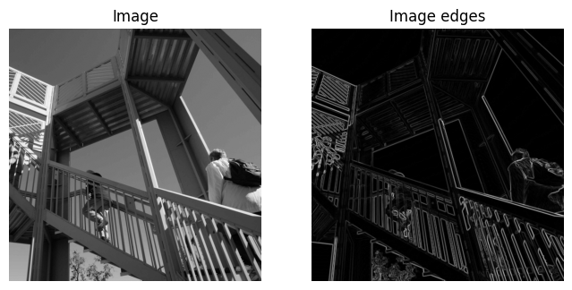

# Learning Edge Detection Operators

In this project, I want to demonstrate a simple example of optimizing for the well-known [Sobel Operator](https://en.wikipedia.org/wiki/Sobel_operator) for edge detection. Edge detection is a very well known classical problem in Computer Vision. Given an image, the edges in the image can be obtained by applying the Sobel operator to each pixel of the image.

Here, I optimize for the values of filter operator ($f^x$), given an image $I$ and its edges $I^{edge}$ using the equations below:
$$ 
\begin{align}
I^{x}_{(i, j)} &= \Sigma_{k=0}^{2} \Sigma_{l=0}^{2} I_{(i+k-1, j+l-1)} * f^x_{(k, l)} \\
I^{y}_{(i, j)} &= \Sigma_{k=0}^{2} \Sigma_{l=0}^{2} I_{(i+k-1, j+l-1)} * f^y_{(k, l)}\\
I^{edge} &= \sqrt{Ix*Ix + Iy*Iy}
\end{align}
$$

An example of an image (in grayscale) and its edges is shown below:


The Sobel Operators are given by $f^x= \begin{pmatrix} -1 & 0 & 1 \\ -2 & 0 & 2 \\ -1 & 0 & 1 \end{pmatrix}$ and $f^y = (f^x)^T$.

I try to answer 2 questions:

1. Given the image and its edges, can we learn the edge detection filters used? Do we end up recovering filters close to the Sobel operator?

    * The current implementation has 2 versions : `sobel_torch.py` is an implementation using the `torch.nn.functional.conv2d` operator. The file `sobel_warp.py` contains a [NVIDIA Warp](https://nvidia.github.io/warp/)-based kernel to compute the 2D convolution in a differentiable manner to support gradient backpropagation.
    
    * Both these modules learn operators very close to the Sobel operator when initialized with [Kaiming Initialization](https://pytorch.org/docs/stable/nn.init.html#torch.nn.init.kaiming_uniform_). I noticed that initialization plays an important role in covergence (due to the presence of local minima).

    * Convergence of the custom conv2D warp kernel is faster when it accumulates the stencil convolutions into `wp.float64` as opposed to `wp.float32`.

    * The optimization is summarized below 
    ```
        Init parameters = tensor([[[[ 0.1879,  0.2403, -0.0151],
          [-0.0489,  0.0236, -0.1757],
          [ 0.0140, -0.3393,  0.1610]]]])
        Iter = 99 L1 Loss = 0.047818105667829514
        Iter = 199 L1 Loss = 0.012268793769180775
        Iter = 299 L1 Loss = 0.0042396001517772675
        Iter = 399 L1 Loss = 0.0011748309480026364
        Iter = 499 L1 Loss = 0.0007791607640683651
        Iter = 599 L1 Loss = 0.0006552402628585696
        Iter = 699 L1 Loss = 0.0005757849430665374
        Iter = 799 L1 Loss = 0.0006140933837741613
        Iter = 899 L1 Loss = 0.000583296874538064
        Iter = 999 L1 Loss = 0.0005464371060952544
        Optimized fy = 
                [[ 9.9914e-01,  1.9992e+00,  1.0002e+00],
                [-8.5160e-04,  4.9689e-04, -7.8575e-04],
                [-9.9979e-01, -2.0007e+00, -9.9925e-01]]
        Optimized fx = 
                [[ 9.9914e-01, -8.5160e-04, -9.9979e-01],
                [ 1.9992e+00,  4.9689e-04, -2.0007e+00],
                [ 1.0002e+00, -7.8575e-04, -9.9925e-01]]
    ```

2. What is the speed up gained by implementing a vectorized C++ kernel for convolution in 2D space? (To Be Implemented)

    The C++ kernel with support for vectorization is in progress and will be pushed as soon as it is ready.

#### Installation Instructions
The code has been tested with `warp` version 1.4.1 and `pyTorch` version 2.4.1. To run the code, please install [torch](https://pytorch.org/get-started/locally/), [warp](https://nvidia.github.io/warp/installation.html), [scipy](https://scipy.org/install/) and [numpy](https://numpy.org/install/) <= 1.26.4

Instructions for running the C++ version will be provided soon. Work is in progress.

