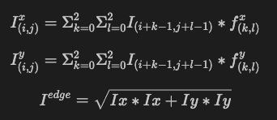

# Learning Edge Detection Operators

In this project, I want to demonstrate a simple example of optimizing for the well-known [Sobel Operator](https://en.wikipedia.org/wiki/Sobel_operator) for edge detection. Edge detection is a very well known classical problem in Computer Vision. Given an image, the edges in the image can be obtained by applying the Sobel operator to each pixel of the image.

Here, I optimize for the values of filter operator ($f^x$), given an image $I$ and its edges $I^{edge}$ using the equations below:

<!-- $$
I^{x}_{(i, j)} = \sum_{k=0}^{2} \sum_{l=0}^{2} I_{(i+k-1, j+l-1)} \cdot f^x_{(k, l)}\\
I^{y}_{(i, j)} = \sum_{k=0}^{2} \sum_{l=0}^{2} I_{(i+k-1, j+l-1)} \cdot f^y_{(k, l)}\\
I^{edge} = \sqrt{I^x * I^x + I^y * I^y}
$$
Since my equations above aren't rendering correctly on github, here's a screenshot :  -->
 

## Why this problem?
Applying the Sobel operator on an image for edge detection consists of 2D convolution operations. Optimizing for the operator is the equivalent for "learning" a Conv2D filter (or learning the weights of a neural network which is composed of a single 2D convolution filter) - which is what convolution neural networks do! Instead of focusing on big & complex problems, I picked this simpler case since it is illustrative of the machinery that goes into most "learning" based problems. My aim in this work is to explore various implementations (ranging from simpler ones using `torch` to complex customized vectorized C++ implementations on the CPU) of learning the weights of a 2D Conv operator and try to understand & explain the observations.

An example of an image (in grayscale) and its edges is shown below ([reference link](https://docs.scipy.org/doc/scipy/reference/generated/scipy.ndimage.sobel.html)):


<!-- The Sobel Operators used to obtain the above result are $f^x = \begin{bmatrix} 
-1 & 0 & 1 \\
-2 & 0 & 2 \\
-1 & 0 & 1
\end{bmatrix}$ and $f^y = (f^x)^T = \begin{bmatrix}
-1 & -2 & -1 \\
0 & 0 & 0 \\
1 & 2 & 1
\end{bmatrix}$. -->

The Sobel Operators used to obtain the above result are 
```
f^x =   -1 0 1
        -2 0 2
        -1 0 1
and f^y = (f^x)^T 
        = -1 -2 -1
           0  0  0
           1  2  1
```

I try to answer 2 questions:

1. Given the image and its edges, can we learn the edge detection filters used? Do we end up recovering filters close to the Sobel operator?

    * The current implementation has 3 versions : All the models can be found in `sobel_models.py`. The class `TorchEdgeFilter` is an implementation using the `torch.nn.functional.conv2d` operator. The file `sobel_warp.py` contains a [NVIDIA Warp](https://nvidia.github.io/warp/)-based kernel to compute the 2D convolution in a differentiable manner to support gradient backpropagation. There is also a vectorized cpp (cpu) implementation of the `conv2d` operator and its gradient in the file `sobel_cpp.py`.
    
    * Both these modules learn operators very close to the Sobel operator when initialized with [Kaiming Initialization](https://pytorch.org/docs/stable/nn.init.html#torch.nn.init.kaiming_uniform_). I noticed that initialization plays an important role in covergence (due to the presence of local minima).

    * Convergence of the custom conv2D warp kernel is faster when it accumulates the stencil convolutions into `wp.float64` as opposed to `wp.float32`. Note that this code is written using warp version `1.4.1` (does not have tile support - present in warp version `1.6.x` onwards)

    * The optimization is summarized below (L1 loss is the loss between the predicted edge image and the ground truth edge image.) 
    ```
        fx (initialization) = 
            tensor([[[[ 0.1879,  0.2403, -0.0151],
            [-0.0489,  0.0236, -0.1757],
            [ 0.0140, -0.3393,  0.1610]]]])
        Iter = 99 L1 Loss = 0.047818105667829514
        Iter = 199 L1 Loss = 0.012268793769180775
        Iter = 299 L1 Loss = 0.0042396001517772675
        Iter = 399 L1 Loss = 0.0011748309480026364
        Iter = 499 L1 Loss = 0.0007791607640683651
        Iter = 599 L1 Loss = 0.0006552402628585696
        Iter = 699 L1 Loss = 0.0005757849430665374
        Iter = 799 L1 Loss = 0.0006140933837741613
        Iter = 899 L1 Loss = 0.000583296874538064
        Iter = 999 L1 Loss = 0.0005464371060952544
        Optimized fy = 
                [[ 9.9914e-01,  1.9992e+00,  1.0002e+00],
                [-8.5160e-04,  4.9689e-04, -7.8575e-04],
                [-9.9979e-01, -2.0007e+00, -9.9925e-01]]
        Optimized fx = 
                [[ 9.9914e-01, -8.5160e-04, -9.9979e-01],
                [ 1.9992e+00,  4.9689e-04, -2.0007e+00],
                [ 1.0002e+00, -7.8575e-04, -9.9925e-01]]
    ```

2. What is the speed up gained by implementing a vectorized C++ kernel for convolution in 2D space?

    I have also included a more efficient implementation of the forward & backward computation of the Sobel filter on a given image. This implementation relies on AVX512 vectorized instruction to implement a dedicated forward and backward 2D convolution functions. It has been tested on `Intel(R) Xeon(R) Gold 6312U CPU`. 
    Using the profiler provided by torch, I want to highlight the following values: (full timing given in `timing.txt`)
    
    ```
    ===== CPP CONVOLUTION2D model =====
    --------------- ------------  ------------  ------------  ------------  
            Name    CPU total %     CPU total   CPU time avg    # of Calls  
    --------------- ------------  ------------  ------------  ------------  
    full_iteration    75.12%        2.596s       2.623ms           990  
        forward       41.41%        1.431s       1.446ms           990  
        backward      25.18%      870.334ms     879.125us          990  
    ```
    ```
    ===== Torch model =====
    ---------------  ------------  ------------  ------------  ------------  
            Name    CPU total %     CPU total   CPU time avg    # of Calls  
    ---------------  ------------  ------------  ------------  ------------  
    full_iteration      100.00%       2.727s       2.754ms           990  
        backward        48.61%        1.326s       1.339ms           990  
        forward         40.48%        1.104s       1.115ms           990  
    ```

    #### Key Takeaways

    First, the time taken for `full_iteration` (forward + backward + parameter update) is lesser for the c++ conv2d implementation by ~100ms (0.1s). 
    
    While the overall speed up is not very significant on the CPU, the backward pass is significantly faster in the c++ implementation [0.87s](when compared to the torch one[1.33s]). This might be becasue of the fact that the gradient evaluation pipeline in torch includes parsing the computational graph and determining what backward operations to compute. However, the custom c++ implementation contains a more efficient (and less versatile) fused kernel implementation that has lesser overhead. 
    
    The time taken for the forward step is higher for the c++ implementation when compared to the torch one - I suspect the padding operation implementation in C++ to be source of this delay (since it is memory bound). To investigate further, I will profile each step of the forward computation in my C++ implementation and update this section in the future.

### Conclusion
In conclusion, it is important to note that this is a very simple but effective example to highlight the significance of building efficient differentiable pipelines. Although pyTorch provides a very flexible framework for fast prototyping, more efficient implementations can be used to get the best performance.

#### Instructions to run the code
The code has been tested with `warp` version 1.4.1 and `pyTorch` version 2.4.1. To run the code, please install [torch](https://pytorch.org/get-started/locally/), [warp](https://nvidia.github.io/warp/installation.html), [scipy](https://scipy.org/install/) and [numpy](https://numpy.org/install/) <= 1.26.4

Instructions for running the C++ version:
```
git clone --recursive git@github.com:sanggs/learning-edge-detection-operators.git
cd learning-edge-detection-operators
mkdir build && cd build
cmake ../
make -j 16 
export OMP_NUM_THREADS=<max_threads_on_your_cpu>
```

The above steps should create a c++ conv2d static library named something like : `cpython-310-x86_64-linux-gnu.so`. We can now import this in python. Thanks to the amazing [nanobind](https://nanobind.readthedocs.io/en/latest/) library that makes it so easy to expose python bindings! If your CPU does not support AVX512, the code will fallback to scalar 2D convolution implementation (with openmp support)

Finally, to run the python code to learn edge detection kernels, use `python3 main.py` (assuming you are in the repo directory).

### How to take this further?
1. This project is meant to be a simple demonstration of how efficient differentiable pipelines can be constructed based on the use case. To improve the performance, we can write dedicated and fused kernels on the GPU as well (similar to the CPU vectorized kernels) : my guess is that the fused CUDA kernels will be only slightly faster than invoking CUDNN convolution forward and backward calls due to the additional overhead in the latter case.

2. The CPU implementation can be further extended to include batch support, varying strides, filter sizes and other options provided by Torch library for a more generic conv2d kernel.

